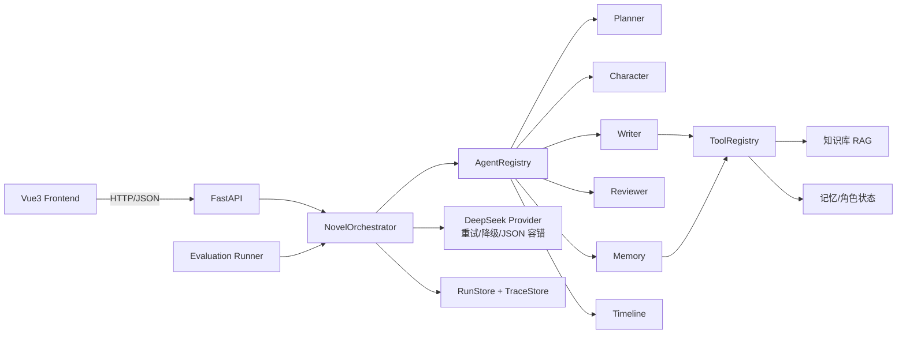

# AI Novel Agent

> Production-oriented Multi-Agent 网文创作系统：Planner → Character →
> Writer → Reviewer（修订闭环）→ Memory → Timeline，配 RAG 检索、
> 可复现 Evaluation / Benchmark、Tool 权限边界、持久化 Trace 与完整
> 前后端（FastAPI + Vue3 + Docker + CI）。

## 这个项目解决什么问题

长篇网文创作的核心难点是**跨章节一致性**与**可量化质量**：

- 角色状态、伏笔、时间线会随章节漂移；
- 章节写完后缺少数百万字级的质量闭环；
- 知识库检索是否有效、审校是否值得开，缺少数据支撑。

本项目用多 Agent 流水线 + 多级记忆 + RAG + Evaluation 系统回答这些问题：
“Agent 不是 Demo，而是可以量化效果的工程系统。”

## 核心能力

- **多 Agent 编排**：Planner → Character → Writer → Reviewer（审校失败
  自动修订，超限返回最高分版本）→ Memory → Timeline，全部经
  `AgentRegistry` 注册，状态显式放 `AgentContext`；
- **Agent 记忆**：工作记忆 / 滚动摘要 / 长期事实（分类 + 重要性 + 去重）/
  时间线一致性检查；
- **RAG**：分块 → 元数据 → 预算注入 / 关键字检索 → 上下文裁剪，
  真实 `BudgetRetriever` vs `KeywordRetriever` 可评测对比；
- **Tool 层**：retrieve_memory / save_memory / get_character /
  update_character / search_knowledge，按 Agent 权限矩阵校验；
- **可观测性**：每步延迟 / LLM 调用 / RAG 调用 / 修订次数 / token 成本，
  运行 Trace 持久化，进程重启可查询；
- **可靠性**：指数退避重试、模型降级列表、JSON 多级容错修复、请求体限制、
  全局异常兜底；
- **评测**：`python -m evaluation.run` 产出检索指标（Hit Rate /
  Precision@K / Context Relevance）与 Agent 指标（Task Success /
  Reviewer Detection / Quality / Latency / Tokens / Cost）。

## 系统架构



## Agent 工作流

```text
Planner → Character
  ↓
Writer ──→ Reviewer
  │          ↓ 通过？
  │        ├─ Yes → Memory / Timeline 更新 → 完成
  └── 修复 ─┴─ No  → Writer 修订 → 复审（最多 N 轮）
```

串行约束：写作依赖规划与人物；记忆与时间线依赖章节完成；
审校与修订必须成对出现。可并行空间：多章在各自状态隔离后可并行写作
（当前版本为顺序执行，接口按 run_id 隔离）。

## 评测结果（mock 模式，真实运行数据）

```text
Retrieval: budget hit=100% / keyword hit=100%
           keyword context relevance 优于 budget（41% vs 37%）
Task Success: 100%   Reviewer Detection: 100%
Average Quality: 92.5   Average Latency: ~3 ms
Average Tokens: ~4600   Total Cost: 0（mock）
```

Agent Benchmark 对比（同一场景，真实测量）：

| 配置 | LLM 调用 | Token 量 | 说明 |
| --- | --- | --- | --- |
| 无审校无记忆 | 3 | ~3000 | 基线，最低成本 |
| +审校 | 4 | ~3900 | 质量闭环，检出注入场景需 6~8 次调用 |
| +记忆+时间线 | 5~6 | ~4600~5600 | 跨章一致性 |

最新报告见 [backend/evaluation/reports/report.md](backend/evaluation/reports/report.md)。

## 快速开始

### 1. 启动后端

```bash
cd backend
python -m venv .venv
.venv\Scripts\activate      # Windows
source .venv/bin/activate   # macOS / Linux
pip install -r requirements.txt
cp .env.example .env        # 填入 DEEPSEEK_API_KEY（不填则走演示模式）
uvicorn app.main:app --reload --port 8000
```

### 2. 启动前端

```bash
cd frontend
npm install
npm run dev
```

打开 http://localhost:5173。API 文档：http://localhost:8000/docs。

### 3. 运行评测（零成本）

```bash
cd backend
python -m evaluation.run                 # mock
EVAL_MODE=real DEEPSEEK_API_KEY=sk-... python -m evaluation.run  # real
```

### 4. Docker（可选）

```bash
cd docker
cp ../backend/.env.example .env
docker compose up --build
```

## 安全设计

- Tool 权限矩阵：Memory 才能写记忆/角色状态，Writer/Reviewer 只读；
- 请求体大小限制（10MB）+ 结构化错误响应 + request_id 追踪；
- 提示词注入防护：注入文本由 Reviewer 检出并触发修订闭环
  （evaluation 场景覆盖）；
- `.env` 不入库，API Key 不泄漏。

## 可靠性设计

- LLM：429/5xx/连接/超时指数退避重试 + 模型降级列表；
- JSON：代码块剥离 / 截断修复 / 宽松引号 / 自动修复调用；
- 运行状态：RunStore（内存 TTL）+ TraceStore（磁盘持久化）；
- 存储：项目 JSON 原子写 + .bak 恢复，SQLite 可选；
- 全局异常兜底：返回 request_id 便于排查。

## 测试与 CI

```bash
cd backend && python -m pytest        # 173 个测试
cd frontend && npm test               # Vitest 单元测试
cd frontend && npm run build          # 类型检查 + 构建
```

CI：backend 测试 + **Evaluation smoke（mock，无 API Key）** +
frontend 类型/构建/单元 + Playwright E2E + Docker 冒烟。

## 文档

- [架构](docs/architecture.md)
- [多 Agent 设计](docs/multi-agent.md)
- [记忆设计](docs/memory.md)
- [Pipeline 说明](docs/pipeline.md)
- [集成说明](docs/integration.md)
- ADR-001 Agent 编排 / ADR-002 RAG / ADR-003 Memory / ADR-004 模型路由 /
  ADR-005 评测策略（docs/adr/）

## License

仅供学习交流使用，未附带开源许可证；引用或再分发请注明出处并自行承担合规责任。
