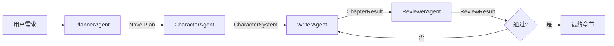

# 多 Agent 小说创作系统

## 架构



## Agent 职责

| Agent | 输入 | 输出 |
| --- | --- | --- |
| PlannerAgent | 用户需求 + RAG | `NovelPlan`（设定 / 主线 / 卷纲 / 章节大纲） |
| CharacterAgent | `NovelPlan` + RAG | `CharacterSystem`（档案 / 状态 / 关系） |
| WriterAgent | 规划 + 人物 + 记忆 + 前文 + RAG | `ChapterResult`（正文 / 全文 / 记忆） |
| ReviewerAgent | 规划 + 人物 + 正文 + 记忆 + RAG | `ReviewResult`（通过 / 评分 / 问题 / 修订意见） |

## AgentContext

`AgentContext` 承载全部运行时状态：run_id、project_id、planner_request、plan、characters、
character_states、relationships、current_arc / current_chapter、chapter_outline、
previous_summary、context_text、previous_chapter_text、retrieved_context、extra_requirements、
attachment、memory、target_length、telemetry 与 metadata。

Agent 之间不通过全局变量通信；所有中间结果显式写入 Context 或返回协议对象。

## Protocol

协议定义在 `backend/app/agents/protocol.py`（Pydantic v1，可序列化 / 可保存）：

- `NovelPlan`：结构化规划，`to_outline()` 可转换为原有 `NovelOutline`；
- `CharacterProfile / CharacterState / CharacterRelation / CharacterSystem`：人物系统；
- `ReviewResult`：复用原有 `ReviewIssue`；
- `ChapterResult / RevisionAttempt / PipelineResult`：写作与编排结果。

## RAG 集成

所有 Agent 复用 `RetrievalProvider`（`budget` / `keyword` 由 `RAG_RETRIEVER` 配置）：

- Planner：按用户需求检索（复用 `novel_retrieval_query`）；
- Character：按规划检索人物 / 世界观；
- Writer：按章节目标 / 角色 / 额外要求检索；
- Reviewer：按章节 / 记忆 / 规划检索设定依据。

RAG 调用统一走 `BaseAgent._retrieve()`：计数、错误包装为 `AgentError("rag")`，不把整个知识库塞入 Prompt。

## Reviewer 修订循环

1. Writer 生成初稿 → Reviewer 审校；
2. 通过条件：`passed=true` 且 `score >= REVIEW_PASS_SCORE` 且 `revision_required=false`；
3. 未通过且未达 `AGENT_MAX_REVISIONS`（默认 2）→ 带修订意见重新写作 → 再审校；
4. 达到上限 → 返回最高分版本，`status=revision_exhausted`，附完整 `revision_history`，不静默失败。

## 错误处理

- `LLMError`（connection / api / parse / unknown）由 `run_llm` 归一化，`BaseAgent` 包装为 `AgentError`；
- RAG 失败包装为 `AgentError("rag")`；输入/输出校验失败为 `AgentError("validation")`；
- 每个错误包含 agent / operation / error_type / run_id / retry_count；
- 禁止 `try/except: pass`，API 返回结构化错误体。

## 可观测性

`AgentTelemetry` 随每个响应返回：

- llm_calls / rag_calls / revision_attempts；
- steps：每个 Agent 的名称、状态、耗时、输入/输出类型；
- duration_ms、run_id。

## 如何新增 Agent

1. 在 `backend/app/agents/` 新建 `xxx_agent.py`，继承 `BaseAgent[T]`；
2. 实现 `_run`、`validate_input`、`validate_output`；
3. 在 `registry.py` 注册：`default_registry.register("xxx", XxxAgent)`；
4. 在 `api/agents.py` 新增端点（如需要）；
5. 新增测试。

## 如何测试

- 不依赖真实 LLM：使用 `MockProvider` / `ScriptedLLM` / `FakeRetriever`（见 `backend/tests/agents_test_utils.py`）；
- 覆盖：协议序列化、输入/输出校验、成功与演示、LLM/RAG 异常、通过/驳回/修订循环、最大修订次数、完整 Pipeline、API 集成；
- 运行：`cd backend && python -m pytest`（无 API Key 也可全部通过）。

## 如何运行 Pipeline

```bash
cd backend
uvicorn app.main:app --host 127.0.0.1 --port 8000
```

```bash
curl -X POST http://127.0.0.1:8000/api/agents/pipeline \
  -H "Content-Type: application/json" \
  -d '{"genre":"武侠","theme":"无敌流","requirement":"10万字","volume_index":0,"chapter_index":0,"save":false}'
```

未配置 `DEEPSEEK_API_KEY` 时返回 `status=demo` 的演示结果。
